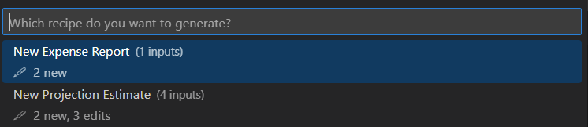
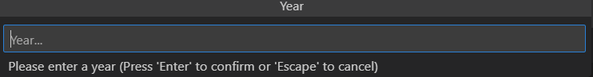
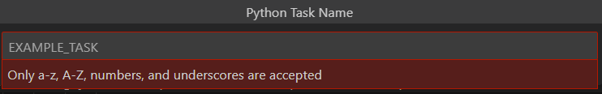

# Simple Code Generator

This extension allows users to describe "recipes" for collecting user input values in order to transform existing files or create new ones. 

# Recipe
You can specify multiple recipes in your `.vscode/settings.json` file. A recipe can be constructed and customized from the following components:
* [Inputs](#inputs)
* [Templates](#templates)
* [Update Targets](#update-targets)
* [Create Targets](#create-targets)

<figure>
    
    <figcaption><i>Recipe Picker</i></figcaption>
</figure>
<p><br></p>

# Inputs

A recipe's optional list of inputs allows you to specify symbols or keywords that should be replaced if encountered in templates, update targets, or the recipe object itself. For example, if a recipe contaied an input object that collected a year from a user and mapped it to a symbol called `${YEAR}` this symbol would be replaced by the user provided value.

### Example Recipe (~/workpace/.vscode/settings.json)
Only relevant fields are included in this snippet
```json
"simpleCodeGen.recipes": [
  {
    "name": "Finalize Report",
    "inputs": [
      {
        "title": "Year",
        "suggestion": "Year...",
        "prompt": "Please enter a year",
        "symbol": "${YEAR}",
        "regexValidator": "^(19|20)\\d{2}$",
        "regexErrorDescription": "Only years after 1900 are valid",
      }
    ],
    "updateTargets": [
      {        
        "path": "predicted_report_${YEAR}.txt // --> path becomes: collected_report_2022" 
      }
    ],
    "createTargets": [
      {
        "outputPath": "${workspace}/final_reports_${YEAR} // --> your_workspace/final_reports_2022"
      }
    ]
  }
]
```

<figure>
    
    <figcaption><i>Text input</i></figcaption>
</figure>
<p><br></p>
<figure>
    
    <figcaption><i>Text input with validation</i></figcaption>
</figure>
<p><br></p>

## Text Input Object Properties
Only relevant fields are included in this snippet
```json
{
  "title":                 "[Required] Title of the input window", 
  "suggestion":            "[Required] Preview shown when the input box is empty",
  "prompt":                "[Required] Text suggestion under the input box",

  "symbol":                "[Required] Symbol that will be replaced with the provided value",

  "defaultValue":          "[Optional] The initial value will be present in the input box",
  "regexValidator":        "[Optional] Expression that will validate the input",
  "regexErrorDescription": "[Optional] Message to show if the input value violates the expression",

}
```

In some situations where the value you want to map to a symbol exists within a fixed set choices it might be more convenient to allow users to select it from a list of options. This can be achieved by adding the optional `fixedChoices` array to your input properties.

<figure>
    
    <figcaption><i>Input with fixed choices</i></figcaption>
</figure>


## Fixed Choice Object Properties
Only relevant fields are included in this snippet
```json
{
  "title":           "[Required] Title of the input window",
  "suggestion":      "[Required] Preview shown when the input box is empty",
  "prompt":          "[Required] Text suggestion under the input box",
  "symbol":          "[Required] Symbol that will be replaced with the provided value",
  "fixedChoices": [
    {
      "title":       "[Required] Title to display for the option",
      "value":       "[Required] Value to swap with located symbol",
      "description": "[Optional] Description of what this option means",
    }
  ]
}
```
<p><br></p>


# Templates

Templates are the snippets of code or text you would like to use to update existing files or create new ones. Templates can either be written in the recipe itself using the `singleLine` property or read from a file using the `path` property. New lines and whitespace are preserved in both. 

A template's `symbolArguements` property is optional exclusive list of input symbols that will be evaluated. The default behavior will consider all input symbols for this template, but you can use this property if you want to limit the inputs to a smaller subset.

 A template must have at least one entry in `updateTargets` or `createTargets`. The target string should match the `name` property of the updateTarget or createTarget.

```json
  {
      "name":             "[Optional] A name to give this template",
      "symbolArguements": [],

      "path":             "[Required] path to template file (This can contin input symbols)", 
      "singleLine":       "[Required] value is treated as the template (This can contain input symbols)", 

      "updateTargets":    [],
      "createTargets":    []
  }
```

## Welcome_template.txt (Example Template)
In this example the template specifies one create target `welcome_template`. Since the template does not specify any `symbolArguements` we will consider swapping out any matched input symbols while parsing. Once the template matched input symbols have been replaced we will output the result to any listed create or update targets. In this case only the create target `welcome_template` needs this information.

#### Example Recipe
```json
"simpleCodeGen.recipes": [
  {
    "inputs": [
      "_comment": "/* ${CANDIDATE_NAME}, ${JOB_TITLE}, ${AUTHOR} */ | Inputs we are collecting for this recipe"
    ],

    "templates": {
      "path": "${workspace}/welcome_template.txt",
      "createTargets": ["welcome_candidate"]
    },

    "create_targets": [
      {
        "name": "welcome_template",
        "outputFileName": "${CANDIDATE_NAME}_${JOB_TITLE}_welcome.txt",
        "outputPath": "${workspace}/candidates"
      }
    ]
  }
]
```

### Template Pre-compile
```
Hello ${CANDIDATE_NAME},

Welcome to the team! We are so excited you are joining the team as a ${JOB_TITLE}.

Looking forward to meeting you,

${AUTHOR_NAME}
```
<p><br></p>

### Template Post-compile (This text will be provided to the output target)
```
Hello Bruce,

Welcome to the team! We are so excited you are joining the team as a billionaire.

Looking forward to meeting you,

Lucius Fox
```
<p><br></p>

# Update Targets

An update target describes a file and criteria for how a populated template will be used to update a file. The `name` property of an update target must match exactly with the `update_targets` array specified by a template, otherwise it will be ignored.

### Update Target Properties
```json
{
  "name":                         "[Required] Name a template must reference",
  "path":                         "[Required] The path of the file that will be updated, (This can contain input symbols)",

  "insertCriteria": {
      "position":                 "[Required] where the template will be inserted (before|after)",
      "matchMode":                "[Required] how the line match will be evaluated (useString|useRegex)",

      "insertAtLineMatching":     "[Required] This decides which line we will set as our update index for the template. If `stopSearchAtLineMatching` is not specifed the first match will be used",

      "stopSearchAtLineMatching": "[Optional] This decides which line we will stop searching for an update index. When this criteria matches the current line being read the most recent `insertAtLineMatching` match index will be used to insert the populated template"
  }
},

```
<p><br></p>

# Create Targets
A create target describes a new file that will be created from a populated template. Note if this file already exists it will be overwritten.

### Create Target Properties
```json
{
  "name":           "[Required] A template create target must specify this name",
  "outputFileName": "[Required] Name of the output file (This can contain input symbols)",
  "outputPath":     "[Required] Name of the output direction (This can contain input symbols)"
},

```
<p><br></p>

# Perforce support (Experimental)
If you want to extension to try to use p4 operations from detected enviroments please add the following to your `.vscode/settings.json`:
```json
{
  "simpleCodeGenerator.useP4Features": true
}
```
## Detecting Workspaces
The extension will attempt to determine the available workspaces for the current user by executing the following command and parsing the output. 
```
p4 clients --me
```

For every create or update target the extension will search through this list of known workpaces for a workspace root path that includes the output file path. The matched workspace for the create/update target will be specified in the edit/add command line arguements:
```
// Update Target
p4 -c ${matched_workspace} edit example.txt

// Create Target
p4 -c ${matched_workspace} add example.txt
```

<p><br></p>

## Detecting Pending Changelists
The following command is used to determine the users pending change lists.
```
p4 changes --me -s pending
```
Note, the change list input picker displayed to the user will only show pending change lists for the workspace the extension is running in. If your create and update target(s) live in multiple different workspaces only the default change list option is supported.


<p><br></p>

## WIP/Issues
* Detecting a p4 workspace is still experimental


**Thank you!**
