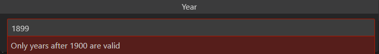
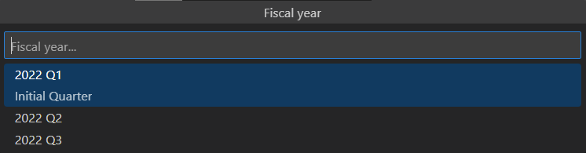

# Simple Code Generator

This extension allows users to describe "recipes" for collecting user inputed values in order to transform existing files or create new ones.

# Recipe
* [Inputs](#inputs)
* [Templates](#templates)
* [Update Targets](#update-targets)
* [Create Targets](#create-targets)

<p><br></p>

## Inputs
___

A recipe's optional list of inputs allows you to specify symbols or keywords that should be replaced if encountered in templates, update targets, or the recipe object itself. For example, if a recipe contaied an input object that collected a year from a user and mapped it to a symbol called `${YEAR}` this symbol would be replaced by the user inputed value.

### Example Recipe (~/workpace/.vscode/settings.json)
```json
"simpleCodeGen.recipes": [
  {
    "name": "Finalize Report",
    "inputs": [
      {
        "title": "Year",
        "suggestion": "Year...",
        "prompt": "Please enter a year",
        "symbol": "${YEAR}",
        "regexValidator": "^(19|20)\\d{2}$",
        "regexErrorDescription": "Only years after 1900 are valid",
      }
    ],
    "updateTargets": [
      {
        // path becomes: collected_report_2022
        "path": "predicted_report_${YEAR}.txt" 
        ...
      }
    ],
    "createTargets": [
      {
        // output path becaues: your_workspace/final_reports_2022
        "outputPath": "${workspace}/final_reports_${YEAR}"
        ...
      }
    ]
  }
]
```

<figure>
    
    <figcaption><i>Text input</i></figcaption>
</figure>
<figure>
    
    <figcaption><i>Text input with validation</i></figcaption>
</figure>

### Text Input Object Properties
```json
{
  // [Required]
  "title":                 "", // Title of the input window
  "suggestion":            "", // Preview shown when the input box is empty
  "prompt":                "", // Text suggestion under the input box

  "symbol":                "", // Symbol that will be replaced with the provided value

  // [Optional]
  "defaultValue":          "", // The initial value will be present in the input box
  "regexValidator":        "", // Expression that will validate the input
  "regexErrorDescription": "", // Message to show if the input value violates the expression

}
```

In some situations where the value you want to map to a symbol exists within a fixed set choices it might be more conveient to allow users to select it from a list of options. This can be achived by adding the optional `fixedChoices` array to your input properties.


<figure>
    
    <figcaption><i>Input with fixed choices</i></figcaption>
</figure>


### Fixed Choices Object Properties
```json
{
  // [Required]
  "title":           "", // Title of the input window
  "suggestion":      "", // Preview shown when the input box is empty
  "prompt":          "", // Text suggestion under the input box
  "symbol":          "", // Symbol that will be replaced with the provided value
  "fixedChoices": [      // List of fixed options
    {
      // [Required]
      "title":       "", // Title to display for the option
      "description": "", // Description of what this option means
      "value":       ""  // Value to swap with located symbol
    },
    // ...[# other choices]
  ],

}
```
<p><br></p>


## Templates
___
Templates are the snippets of code or text you would like to use to update existing files or create new ones. Templates can either be written in the recipe itself using the `singleLine` property or from a file using the `path`. property. New lines and whitespace are preserved in both.

```json
  {
      // [Optional]
      "name":             "", // A name to give this template
      "symbolArguements": [], // Exclusive list of input symbols that will be evaluated,
                              // default behavior will consider all input symbols for this template

      // [Required]
      "path":             "", // Path to template file (This can contin input symbols)
      // or
      "singleLine":       "", // Value is treated as template (This can contain input symbols)

      // [Required] - at least one update or create target
      "updateTargets":    [], // A list of update targets this compiled template will be forwarded to
      "createTargets":    []  // A list of create targets this compiled template will be forwarded to
  }
```

### Welcome_template.txt (Example Template)
In this example the template specifies one create target `welcome_template`. Since the template does not specify any `symbolArguements` we will consider swapping out any matched input symbols while parsing. Once the template matched input symbols have been replaced we will output the result to any listed create or update targets. In this case only the create target `welcome_template` needs this information.
#### Example Recipe
```json
"simpleCodeGen.recipes": [
  {
    // The inputs we are collecting for this recipe
    "inputs": [/* ${CANDIDATE_NAME}, ${JOB_TITLE}, ${AUTHOR} */],

    // The content which will be populated with input values
    "templates": {
      "path": "${workspace}/welcome_template.txt",
      "createTargets": ["welcome_candidate"]
    },

    // Where we will output the compiled template to
    "create_targets": [
      {
        "name": "welcome_template",
        "outputFileName": "${CANDIDATE_NAME}_${JOB_TITLE}_welcome.txt",
        "outputPath": "${workspace}/candidates"
      }
    ]
  }
]
```
#### Template Pre-compile
```
Hello ${CANDIDATE_NAME},

Welcome to the team! We are so excited you are joining the team as a ${JOB_TITLE}.

Looking forward to meeting you,

${AUTHOR_NAME}
```
#### Template post compile (This text will be provided to the output target)
```
Hello Bruce,

Welcome to the team! We are so excited you are joining the team as a billionare.

Looking forward to meeting you,

Lucius Fox
```
<p><br></p>

## Update Targets
___
An update target describes a file and criteria for how a populated template will be used to update a file. The `name` property of an update target must match exactly with the `update_targets` array specified by a template, otherwise it will be ignored.

### Update Target Properties
```json
{
  // [Required]
  "name":                         "", // Name a template must reference
  "path":                         "", // The path of the file that will be updated
                                      // (This can contain input symbols)
  "insertCriteria": {
      // [Required]
      "position":                 "", // before|after - where the template will be inserted
      "matchMode":                "", // useString|useRegex
                                      // * useString - check if line contains exact matches
                                      // * useRegex  - check if line matches against the regex

      "insertAtLineMatching":     "", // This decides which line we will set as our update index
                                      // for the template. If `stopSearchAtLineMatching` is not
                                      // specifed the first match will be used

      // [Optional]
      "stopSearchAtLineMatching": ""  // This decides which line we will stop searching for an update index.
                                      // When this criteria matches the current line being
                                      // read the most recent `insertAtLineMatching` match
                                      // index will be used to insert the populated template
  }
},

```
<p><br></p>

## Create Targets
A create target describes a new file that will be created from a populated template. Note if this file already exists it will be overwritten.

### Create Target Properties
```json
{
  // [Required]
  "name":           "", // A template create target must specify this name
  "outputFileName": "", // Name of the output file (This can contain input symbols)
  "outputPath":     ""  // Name of the output direction (This can contain input symbols)
},

```
<p><br></p>


## Known Issues
---
* Detecting a p4 workspace is still expiremental


**Enjoy!**
